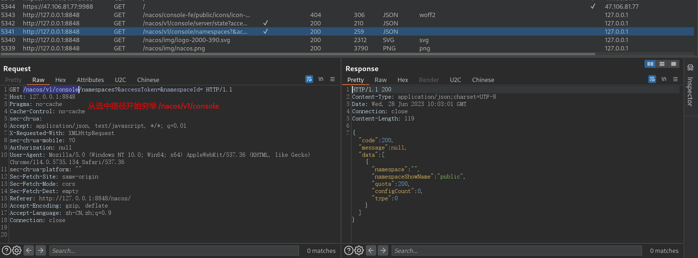

# MorePossibility

MorePossibility (更多可能性) 通过Grpc实现Burp跨语言拓展 , 达到使用python、go、php等Grpc支持的语言进行扩展


### 起源

```
早期在面对流量加密想要使用迭代器处理时往往是先对载荷进行处理之后在放到列表中进行迭代处理
之后便使用burpy和其他用于跨语言联动burp的插件但是体验都不好，而且只支持python

有时我们需要对流量进行处理比如想要丢弃某个请求,但是由于不熟悉burpAPI的开发规范只能用手动拦截的方式丢弃
在面对流量加密时,即便已经获取到的加解密算法但是由于不能在burp渲染更直观的操作而加大的系统评估的难度
有时想要将所有burp流量提取并推送到elasticsearch建立索引,苦于java限制而不能实现,想要实现就要编写java代码

有时工具和框架并不是一个好东西，因为他在向你提供功能的同时也束缚住了你，让你局限在他的规则和功能之下

因此我们设计并开发了MorePossibility 译文是 更多可能性 我们不提供任何实质性功能，只是提供一道桥梁，让渗透测试者在面对问题时可以有更多可用手段,有更多的想象空间和可能性
```


插件截图


### 快速了解

#### 先前条件

该插件实现跨语言拓展靠的是Grpc , 我们将BurpAPI中的函数做成了Grpc接口函数

该拓展建立在Grpc上如果你此前对Grpc一无所知 , 你需要先了解Grpc

不需要太深只要看懂hello world 就行  

官网: https://grpc.io/     (选择自己擅长的语言)

哔哩哔哩狂神 https://www.bilibili.com/video/BV1S24y1U7Xp


### 未来展望

1、通过注册右键菜单项实现选中路径自动穷举目录




